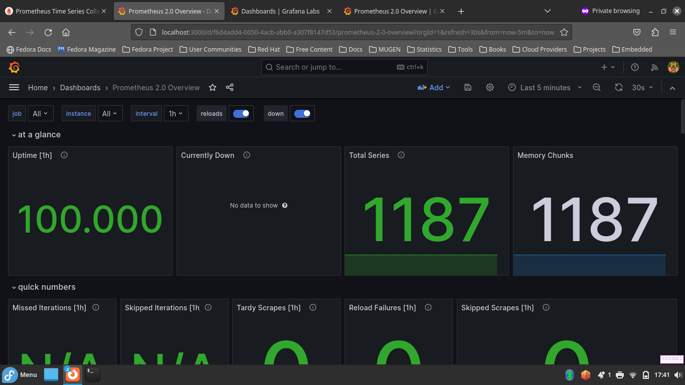
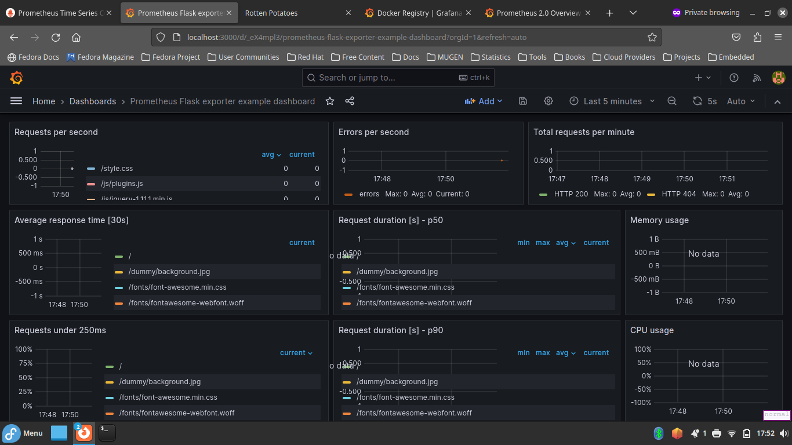
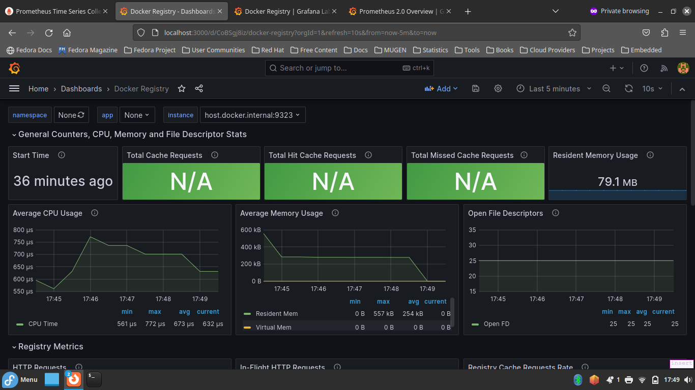

# Meu primeiro laboratório de monitoramento com Prometheus

---

## Introdução

Este projeto trata-se de um laboratório que fiz enquanto acompanhei [uma aula de Prometheus do Fabrício Veronez](https://www.youtube.com/watch?v=mwIQJ1m9ulY&pp=ygUSUHJvbWV0aGV1cyBWZXJvbmV6).

---

## Arquitetura

Neste projeto, há a implementação de uma stack baseada em container com a ferramenta Docker Compose, em que há a definição dos seguintes containers no arquivo [compose.yml](./compose.yml):

* [Aplicação web rotten-potatoes](https://github.com/KubeDev/rotten-potatoes)
* MongoDB
* Prometheus
* Grafana

---

## Utilização do projeto

### Pré-requisitos

* [Docker instalado em sua máquina](https://docs.docker.com/get-docker/)

#### Monitoramento do Docker Daemon

Para poder monitorar o Docker daemon, siga as seguintes etapas:

1. Adicionar o trecho de código json abaixo no arquivo /etc/docker/daemon.json

```json
{
  "metrics-addr": "0.0.0.0:9323"
}
```

2. Alterar o valor da variável prometheus.extra\_hosts.host.docker.internal no arquivo [compose.yml](./compose.yml) para o IP da sua máquina local.

3. Reiniciar o serviço do Docker daemon com o seguinte comando:

`sudo systemctl restart docker`

### Execução

Para subir a Stack, execute:

`docker compose up -d`

Para destruir a Stack e apagar volumes criados pelo Compose, execute:

`docker compose down -v`

---

## Dashboards

### Capturas de tela

---

<figure>
  
  <figcaption>Dashboard do job "prometheus", em que há o monitoramento do próprio Prometheus</figcaption>
</figure>

---

<figure>
  
  <figcaption>Dashboard do job "rotten-potatoes", em que há o monitoramento da aplicação web rotten-potatoes</figcaption>
</figure>

---

<figure>
  
  <figcaption>Dashboard do job "docker", em que há o monitoramento do Docker daemon</figcaption>
</figure>

---

### Fontes dos Dashboards

* [Dashboard utilizado pelo job "prometheus"](https://grafana.com/grafana/dashboards/3662-prometheus-2-0-overview/)
* [Dashboard utilizado pelo job "rotten-potatoes"](https://github.com/rycus86/prometheus_flask_exporter/blob/master/dashboards/flask_webapp.json)
* [Dashboard utilizado pelo job "docker"](https://grafana.com/grafana/dashboards/9621-docker-registry/)
